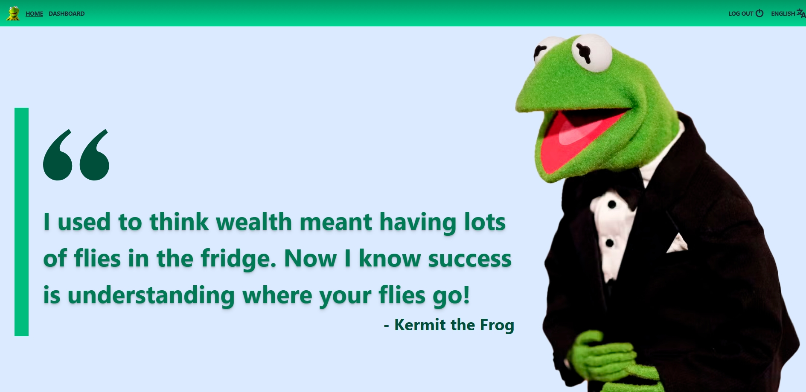
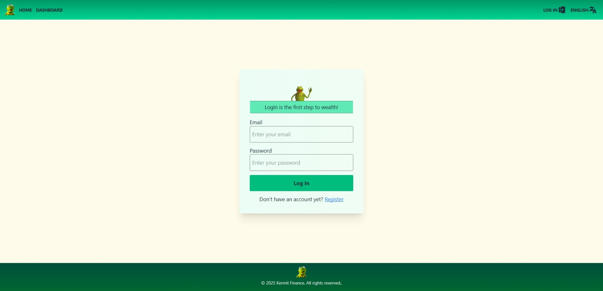
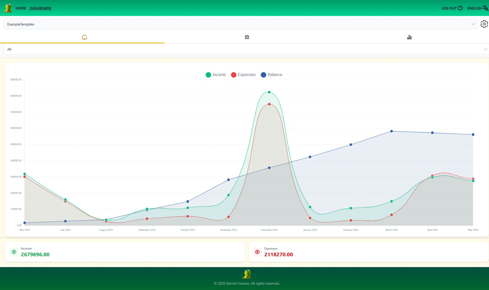
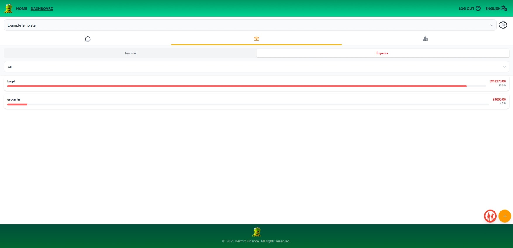

### Домашняя страница

### Страница входа/регистрации

### Вкладка статистики для счета за период "Все"

### Просмотр категорий с фильтром "расходы" для счета за период "Все"

# ExpenseManager

**ExpenseManager** - это веб-приложение для учета доходов и расходов с интеграцией с Telegram-ботом и возможностью импорта банковской выписки из Kaspi. Проект разделен на две части: Backend и Frontend. Backend реализован на C# и .NET Core 9.0 Preview, а Frontend использует Vue.js с TailwindCSS для стилизации.

---

# Технологии
- **Backend**: C#, .NET Core 9.0, EF Core, JWT, Telegram.Bot, Serilog, SQLite
- **Frontend**: Vue.js, Vite, Axios, TailwindCSS, vue-i18n, chart.js

---

## Архитектура

### Backend

Backend разделен на 4 проекта, каждый из которых выполняет свою роль в архитектуре приложения:

- **Core**: Содержит сущности, абстракции и корневые сервисы.
- **Bot**: Функциональность Telegram-бота.
- **Infrastructure**: Реализация абстракций и конфигурация базы данных.
- **WebAPI**: Стартовый проект для запуска сервера и обработки API запросов с Frontend части.

---

### Сущности

Проект использует 5 основных сущностей:

1. **AppUser**: Класс для пользователя.
2. **BankAccount**: Класс для банковского счета.
3. **BankTransfer**: Класс для банковского перевода, универсальный для расходов и доходов.
4. **BankTransferCategory**: Класс для категории банковского перевода.
5. **BankTransferFilter**: Класс для фильтрации переводов на стороне сервера.

---

### Абстракции

1. **IBuilders**:
   - Реализованы билдеры для всех сущностей.
   - Билдеры содержат методы:
     - `Reset()` - для создания копии существующей сущности или создания новой.
     - `Reference()` - для изменения существующей сущности без копирования.
     - `Set...` - для заполнения полей сущности.
     - `Build()` - для получения ссылки на собранный объект.

2. **IRepository**:
   - Реализованы репозитории для всех сущностей.
   - Репозитории обеспечивают отделение логики работы с базой данных от бизнес-логики.

3. **ITokenService**:
   - Абстракция для сервиса по генерации JWT токенов.

---

### База данных

В проекте используется **SQLite** для упрощенной разработки и **EF Core** для работы с базой данных.

---

### Телеграм-бот

Работа с Telegram-ботом осуществляется через библиотеку **Telegram.Bot**. Обработка команд организована с помощью паттерна **Command** и фабрики команд **CommandFactory**.

---

### API

API реализовано по архитектуре **REST**, и поддерживает **CRUD** операции для всех сущностей.

---

### Сервисы

- **LocalizationService**: Предоставляет типизированные строки для локализации.
- **PdfService**: Обрабатывает PDF выписки из Kaspi.kz и добавляет переводы в базу данных.

---

## Frontend

Frontend разработан с использованием **Vue.js**, а стилизация организована через **TailwindCSS**.

- Для обращения к API используется **Axios**.
- В приложении реализована маршрутизация с поддержкой страницы 404 для неизвестных путей.
- Поддержка двух языков: русский и английский (с использованием **vue-i18n** на фронтенде).

---

## Локализация

Проект поддерживает локализацию на два языка:
- **Backend**: Локализация через **LocalizationService**.
- **Frontend**: Локализация через **vue-i18n**.

---

## Запуск проекта

### Требования

- .NET Core 9.0 (или более поздняя версия)
- Node.js (для Frontend)

### Настройка после клонирования репозитория
Для запуска проекта после клонирования репозитория необходимо выполнить начальную настройку.
---
откройте и измените значения словаря params в файле configurator.py своими, после чего запустите его двойным кликом или через консоль: скрипт создаст нужные файлы конфигураций и баз данных. при желании можно выполнить это вручную: 
1. Конфигурация:
  1. скопируйте файл appsettings.template.json из папки `ExpenseManager/config` в папку `ExpenseManager/src/backend/ExpenseManager.WebAPI`; переименуйте файл в appsettings.json и заполните своими данными.
  2. скопируйте файл .env.template из папки `ExpenseManager/config` в папку `ExpenseManager/src/frontend`; переименуйте файл в .env и заполните своими данными.
2.  откройте терминал и перейдите в папку `ExpenseManager/src/`, выполните команду для создания сертификата `dotnet dev-certs https -ep certificate.pfx -p 123` (вместо 123 - ваш пароль, который вы указали в appsettings.json)
3.  откройте терминал и перейдите в папку `ExpenseManager/src/backend`, создав и применив миграцию:
  1. `dotnet tool install --global dotnet-ef` (Если у вас не установлено средство EF)
  2. `dotnet ef migrations add InitialCreate --project ./ExpenseManager.Infrastructure --startup-project ./ExpenseManager.WebAPI`
  3. `dotnet ef database update --project ./ExpenseManager.Infrastructure --startup-project ./ExpenseManager.WebAPI`
---
Теперь можно запустить проект:
1. выполните из папки `ExpenseManager/src/backend` команду `dotnet run --project ./ExpensesManager.WebAPI`
2. выполните из папки `ExpenseManager/src/frontend` команды `npm install` и `npm run dev`
3. перейдите по адресу `https://localhost:{ваш порт для фронтенда}` (указан в консоли, где вы запустили проект фронтенда)
